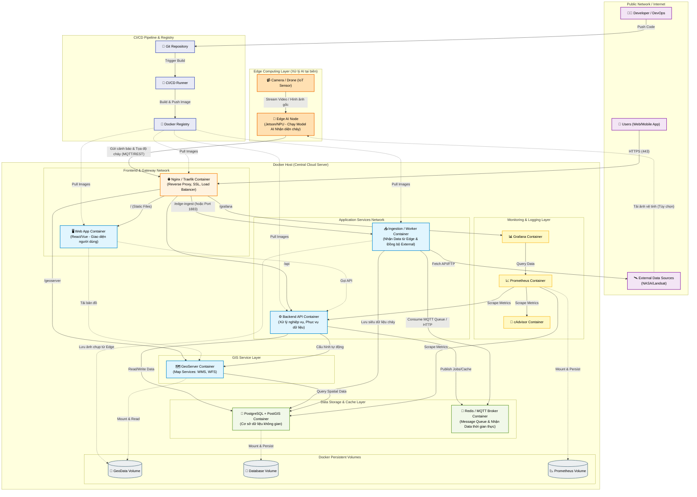

# Wildfire System - Docker Deployment Architecture (Edge AI Integration)

Sơ đồ dưới đây mô tả kiến trúc triển khai thực tế (Physical/Deployment Architecture) của hệ thống quản lý cháy rừng. **Đặc biệt, toàn bộ quá trình xử lý AI (nhận diện cháy) được đẩy xuống thiết bị biên (Edge Computing)** nhằm giảm tải băng thông và độ trễ. Máy chủ trung tâm chỉ đóng vai trò thu thập siêu dữ liệu (metadata), lưu trữ, GIS và hiển thị giao diện.

### 📋 Chi tiết các thành phần và tương tác (Docker Level):

#### 1. Lớp Edge Computing (Xử lý AI tại biên)
Trong kiến trúc mới, máy chủ trung tâm (Central Server) được giải phóng hoàn toàn khỏi các tác vụ chạy Model AI tốn kém tài nguyên.
- **Edge AI Node**: Là các thiết bị biên (ví dụ: NVIDIA Jetson Nano, Xavier hoặc NPU trên Camera).
  - Trực tiếp nhận luồng dữ liệu thô (Video stream, hình ảnh liên tục) từ **Camera/Drone**.
  - Chạy mô hình AI (Deep Learning, Computer Vision) ngay tại bìa rừng/trạm kiểm lâm để phát hiện khói và lửa.
  - Khi phát hiện cháy, thiết bị chỉ gửi **Siêu dữ liệu (Metadata)** bao gồm: tọa độ điểm cháy, thời gian, mức độ tin cậy (confidence score) và 1 bức ảnh chụp khung hình cháy (snapshot) về máy chủ trung tâm thông qua băng thông hẹp.

#### 2. Lớp Cổng Giao Tiếp Trung Tâm (Reverse Proxy)
- **Nginx / Traefik Container**: 
  - Phân luồng cho người dùng (vào giao diện, xem bản đồ).
  - Đồng thời mở cổng tiếp nhận dữ liệu từ Edge Devices truyền về (thường qua API `/edge-ingest` hoặc định tuyến port MQTT `1883`).

#### 3. Lớp Dịch vụ Ứng dụng & Đồng bộ (Application Layer)
- **Ingestion Container (Thay thế Worker xử lý AI cũ)**: 
  - Nhiệm vụ bây giờ rất nhẹ: Nhận tín hiệu cảnh báo từ Edge Node, xác thực dữ liệu.
  - Lưu ảnh snapshot vào `GeoDataVol`.
  - Ghi nhận tọa độ vào **PostGIS**.
  - Đồng bộ thêm dữ liệu thời tiết hoặc ảnh tĩnh từ NASA nếu cần thiết, chứ KHÔNG nhận diện ảnh.
- **Backend API Container**: Cung cấp API cho hệ thống Web quản lý cháy rừng (Xem danh sách điểm cháy, quản lý người dùng, xuất báo cáo).
- **Web App Container**: Chứa Frontend tĩnh (React/Vue).

#### 4. Lớp GIS (Bản đồ)
- **GeoServer Container**: Đọc tọa độ từ PostGIS (điểm cháy do Edge Node gửi lên) và Polygon (các vùng rừng) để kết xuất thành bản đồ WMS/WFS phục vụ theo dõi trực quan cho Frontend. 

#### 5. Lớp Dữ liệu (Stateful Containers)
- **PostGIS**: Chứa dữ liệu không gian cốt lõi.
- **Redis / MQTT Broker**: Do các thiết bị ở xa gửi cảnh báo bất chợt, việc sử dụng kiến trúc Message Queue (Kafka/RabbitMQ hoặc Mosquitto MQTT) giúp hệ thống trung tâm nhận và xử lý cảnh báo mượt mà, không bị sót khi có lượng lớn request đồng thời (Ví dụ: 1000 camera cùng gửi log lỗi).

#### 6. Lớp Giám Sát & CI/CD
- **Prometheus & Grafana**: Theo dõi RAM/CPU của Server trung tâm.
- Hệ thống CI/CD quản lý việc đẩy code và build Docker images mỗi khi có cập nhật, đảm bảo triển khai không downtime.

